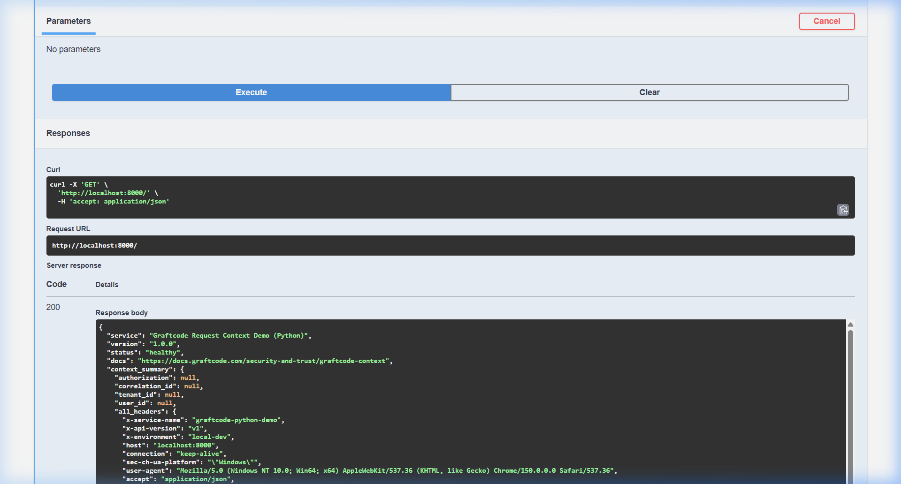
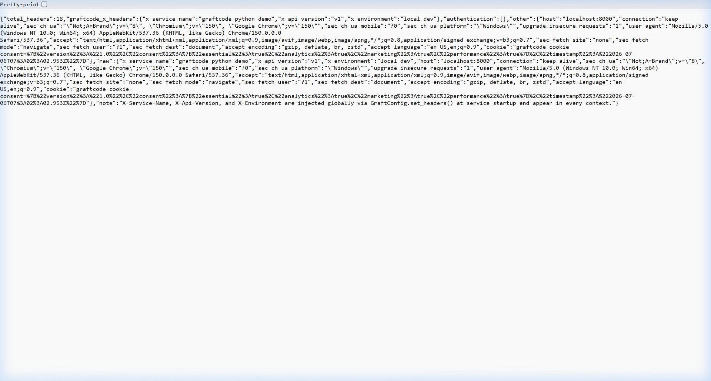
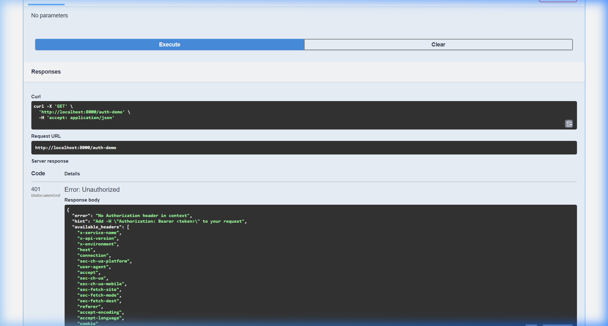
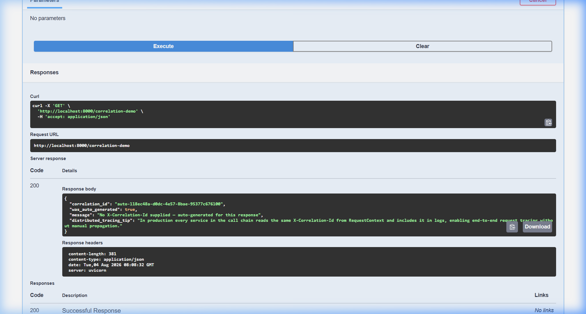
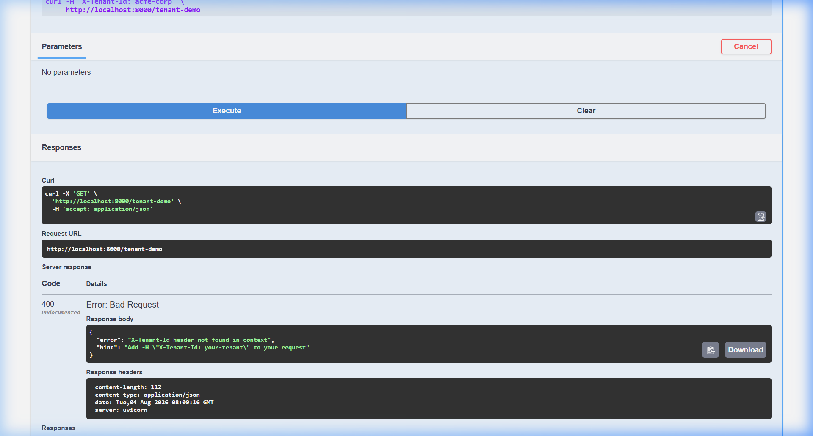
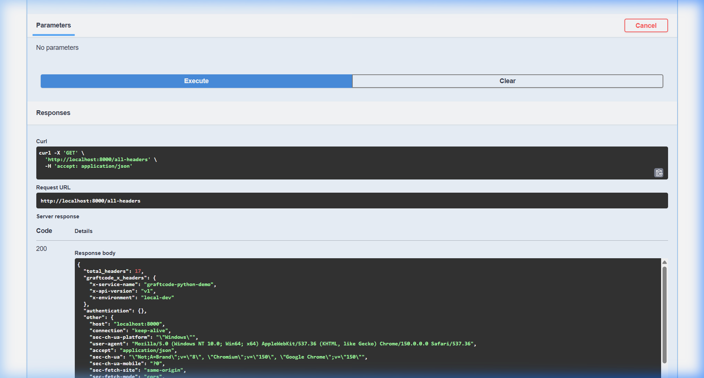
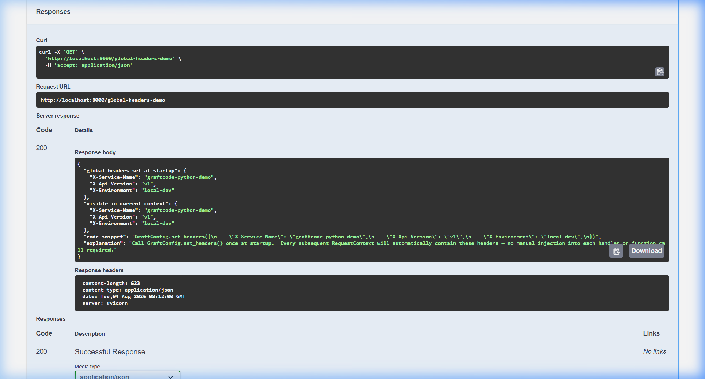
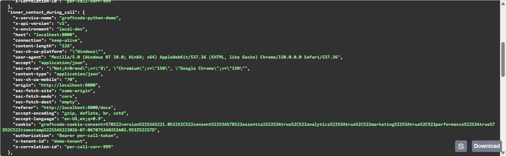
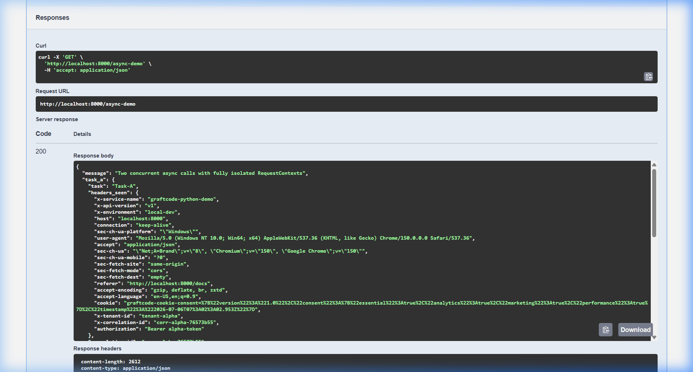

# Build Context-Aware Python Services Without Custom Middleware Using Graftcode

> 

---

## Introduction

Every non-trivial Python service eventually hits the same wall: you need to know *who* is making a request, *which tenant* they belong to, and *where* to trace the call when something goes wrong. The data is right there in the HTTP headers — but threading it through your entire application without creating a mess is harder than it sounds.

This article explores that problem, shows why traditional approaches with Flask and FastAPI middleware create coupling and boilerplate, and demonstrates how **Graftcode Context** eliminates all of it with a single method call anywhere in your code.

---

## Why Request Context Matters in Distributed Systems

In a monolith, request context is annoying but manageable. You might store it in a thread-local, pass it as a function parameter, or smuggle it through a global variable.

In a distributed system, the stakes are higher:

**Authentication** — A JWT must be validated once at the gateway and then *trusted* by downstream services. Re-validating in every service wastes CPU and creates surface area for bugs.

**Correlation IDs** — A user sees a 500 error. Without a correlation ID flowing through every log line — authentication service, order service, inventory service, payment service — finding the root cause means searching through millions of unrelated events.

**Multi-tenancy** — SaaS products must ensure that tenant A never accidentally reads tenant B's data. The safest design routes every database query through a tenant filter that is *automatically* derived from the request, not passed manually.

**Audit logging** — Compliance regulations demand a complete record of who did what. If user ID falls out of the call stack at any layer, your audit log is incomplete.

The common thread: request-scoped data must flow *implicitly* through the entire call graph, not be threaded manually through every function signature.

---

## Traditional Approaches: The Flask/FastAPI Middleware Trap

### Flask: Thread-locals and g

Flask's `g` object provides per-request storage backed by thread-local state:

```python
# Flask approach
from flask import g, request

@app.before_request
def extract_context():
    g.auth_token = request.headers.get("Authorization")
    g.correlation_id = request.headers.get("X-Correlation-Id")
    g.tenant_id = request.headers.get("X-Tenant-Id")
```

This seems elegant until you need the tenant ID five layers deep in your service layer:

```python
# You must thread it through every function, or use g globally
def create_order(user_id: int, items: list):
    tenant_id = g.tenant_id  # Tight coupling to Flask's g
    return db.query(Order).filter_by(tenant_id=tenant_id).all()
```

The problems multiply quickly:
- **Framework lock-in:** `g` only works inside a Flask request context. Unit tests must mock it.
- **Async incompatibility:** Thread-locals break with async frameworks.
- **Hidden coupling:** Your domain logic silently depends on Flask internals.

### FastAPI: Dependency Injection Boilerplate

FastAPI's canonical solution is dependency injection:

```python
# FastAPI approach — dependency injection
from fastapi import Depends, Request

async def get_auth_token(request: Request) -> str:
    return request.headers.get("Authorization", "")

async def get_tenant_id(request: Request) -> str:
    return request.headers.get("X-Tenant-Id", "")

async def get_correlation_id(request: Request) -> str:
    return request.headers.get("X-Correlation-Id", "")

# Every endpoint that needs context must declare dependencies
@app.get("/orders")
async def list_orders(
    auth: str = Depends(get_auth_token),
    tenant: str = Depends(get_tenant_id),
    corr_id: str = Depends(get_correlation_id),
):
    # Now you must pass these to every service function
    return await order_service.list_orders(tenant, auth, corr_id)
```

And the service layer:

```python
# You're now threading context through every function
class OrderService:
    async def list_orders(self, tenant_id: str, auth: str, corr_id: str):
        await self.db.query_with_tenant(tenant_id)
        await self.audit.log(user=auth, corr=corr_id)
        # ...and every sub-call needs these parameters too
```

This is verbose, repetitive, and creates a function signature explosion as the number of context fields grows. It also ties your domain logic to your HTTP layer — making unit testing harder and service reuse nearly impossible.

### Custom Middleware with contextvars

The clever Python developer eventually discovers `contextvars` and rolls a custom solution:

```python
# Custom contextvars approach — you build and maintain this
import contextvars
from starlette.middleware.base import BaseHTTPMiddleware

_auth_var = contextvars.ContextVar("auth")
_tenant_var = contextvars.ContextVar("tenant")
_corr_var = contextvars.ContextVar("correlation")

class ContextMiddleware(BaseHTTPMiddleware):
    async def dispatch(self, request, call_next):
        token_a = _auth_var.set(request.headers.get("Authorization", ""))
        token_t = _tenant_var.set(request.headers.get("X-Tenant-Id", ""))
        token_c = _corr_var.set(request.headers.get("X-Correlation-Id", ""))
        try:
            return await call_next(request)
        finally:
            _auth_var.reset(token_a)
            _tenant_var.reset(token_t)
            _corr_var.reset(token_c)

def get_tenant():
    return _tenant_var.get("")
```

Better! But now you're maintaining your own context library. You need to add new headers, handle defaults, ensure proper reset on exceptions, support nested overrides, document it, and test it — for every service, every team, every language.

---

## How Graftcode Context Simplifies Everything

Graftcode Context is the standardised solution that works on both sides of the equation:

- **Server side:** The Graftcode Gateway automatically populates `RequestContext` before your handler runs. Zero configuration.
- **Client side:** `GraftConfig` lets you set headers globally or per-call from any code that invokes Graftcode services.

Install from PyPI:

```bash
pip install graftcode-context
```

> Package: https://pypi.org/project/graftcode-context/  
> Docs: https://docs.graftcode.com/security-and-trust/graftcode-context

---

## Understanding RequestContext

`RequestContext` is a thread-safe (async-safe) singleton that holds all request headers for the current execution scope. It uses Python's `contextvars.ContextVar` internally, which means each asyncio Task gets its own isolated copy automatically.

```python
from graftcode_context import RequestContext

# Works anywhere in your call stack — handler, service, repository
headers = RequestContext.current().get_headers()

auth_token   = headers.get("Authorization")
correlation  = headers.get("X-Correlation-Id")
tenant_id    = headers.get("X-Tenant-Id")
user_id      = headers.get("X-User-Id")
```

The API is intentionally minimal. There is one method to remember: `RequestContext.current().get_headers()`.

### Server-side usage (no configuration needed)

When your service runs behind the Graftcode Gateway, the Gateway populates `RequestContext` automatically:

```python
# FastAPI handler — no middleware, no Depends(), no parameters
@app.get("/orders")
async def list_orders():
    headers = RequestContext.current().get_headers()
    tenant  = headers.get("X-Tenant-Id")
    user    = headers.get("X-User-Id")
    
    return await order_service.list_for_tenant(tenant, user)
```

```python
# Your service layer — no HTTP framework coupling
class OrderService:
    async def list_for_tenant(self, tenant_id: str, user_id: str):
        # Could also call RequestContext directly here — no parameters needed
        headers = RequestContext.current().get_headers()
        await self.audit.log(
            action="list_orders",
            tenant=tenant_id,
            user=headers.get("X-User-Id"),
            correlation=headers.get("X-Correlation-Id"),
        )
        return await self.db.query(Order, tenant=tenant_id)
```

---

## Global vs Per-Request Headers

Graftcode Context provides two orthogonal header-setting mechanisms through `GraftConfig`, designed for different lifetime requirements.

### GraftConfig.set_headers() — Global, Process-wide

Call this **once at startup** to set headers that apply to all subsequent Graftcode invocations:

```python
from graftcode_context import GraftConfig

# In your main.py, app factory, or startup event
GraftConfig.set_headers({
    "Authorization": "Bearer token123",
    "X-Correlation-Id": "abc-123",
})
```

After this call, every `RequestContext` in the process will contain these headers. Typical use cases:

- **Service identity:** `X-Service-Name: payments-service`
- **API version:** `X-Api-Version: v2`
- **Startup JWT:** Set once after authenticating at boot time

### GraftConfig.invoke_with_headers() — Per-call, Isolated

Use this when you need different headers for a **single invocation**:

```python
from graftcode_context import GraftConfig

# Synchronous
result = GraftConfig.invoke_with_headers(
    lambda: MyService.do_something(),
    {"Authorization": "Bearer different-token"},
)

# Asynchronous
result = await GraftConfig.invoke_with_headers_async(
    lambda: MyService.do_something_async(),
    {"Authorization": "Bearer different-token"},
)
```

The callable runs with the merged context (global defaults + current context + override), and the original context is **automatically restored** when the callable returns — even if an exception is raised.

**Header precedence:** per-call > current context > global defaults

---

## Example: Authentication & Correlation IDs

Let's build a realistic service that handles JWT authentication and distributed tracing without any boilerplate:

```python
from fastapi import FastAPI
from graftcode_context import GraftConfig, RequestContext

app = FastAPI()

# Set service identity once at startup
GraftConfig.set_headers({
    "X-Service-Name": "order-service",
    "X-Api-Version": "v2",
})


@app.get("/orders/{order_id}")
async def get_order(order_id: str):
    headers = RequestContext.current().get_headers()
    
    # Authentication — read directly, no Depends() required
    auth = headers.get("Authorization")
    if not auth or not auth.startswith("Bearer "):
        raise HTTPException(status_code=401, detail="Missing auth token")
    
    # Distributed tracing — already available, no parameter threading
    correlation_id = headers.get("X-Correlation-Id")
    tenant_id      = headers.get("X-Tenant-Id")
    
    # Log with full context
    logger.info(
        "Fetching order",
        extra={
            "order_id": order_id,
            "tenant": tenant_id,
            "correlation": correlation_id,
        }
    )
    
    # Fetch order — tenant isolation is automatic
    order = await order_repo.get(order_id, tenant_id=tenant_id)
    return order
```

Compare this to the FastAPI Depends() version: **3 fewer parameters, no imported dependencies, no coupling to HTTP concerns in your business logic**.

---

## Async Context Propagation with contextvars

The critical correctness guarantee for async services is that **concurrent requests never see each other's context**. Graftcode Context achieves this using Python's `contextvars` module.

### How Python contextvars work

Each `asyncio.Task` starts with a *copy* of the context that existed when it was created (copy-on-write semantics). Setting a `ContextVar` inside a task affects only that task's copy:

```python
import asyncio, contextvars

var = contextvars.ContextVar("x")
var.set("global")

async def task_a():
    var.set("task-a")
    await asyncio.sleep(0.1)
    assert var.get() == "task-a"  # ✓ isolated

async def task_b():
    var.set("task-b")
    await asyncio.sleep(0.1)
    assert var.get() == "task-b"  # ✓ isolated

asyncio.run(asyncio.gather(task_a(), task_b()))
```

### Graftcode's guarantee

`GraftConfig.invoke_with_headers_async()` binds a new `RequestContext` to the calling coroutine before invoking your callable. Even if two concurrent tasks both call `invoke_with_headers_async()` with different headers, each gets a completely private view:

```python
async def handle_request(tenant: str) -> dict:
    async def _work():
        await asyncio.sleep(0.05)  # simulate I/O
        headers = RequestContext.current().get_headers()
        return {"tenant": headers.get("X-Tenant-Id")}

    return await GraftConfig.invoke_with_headers_async(
        _work, {"X-Tenant-Id": tenant}
    )

# Run concurrently — guaranteed isolation
results = await asyncio.gather(
    handle_request("acme-corp"),
    handle_request("startup-co"),
    handle_request("demo-tenant"),
)
# results[0]["tenant"] == "acme-corp"    ✓
# results[1]["tenant"] == "startup-co"  ✓
# results[2]["tenant"] == "demo-tenant" ✓
```

---

## Running Locally and with Docker / Graftcode Gateway

### Local development

For local development without a Gateway, use `GraftcodeMiddleware` to simulate Gateway behaviour:

```python
from fastapi import FastAPI
from graftcode.middleware import GraftcodeMiddleware

app = FastAPI()
app.add_middleware(GraftcodeMiddleware)
```

```bash
PYTHONPATH=src uvicorn src.service:app --reload --port 8000
```

### Docker

```bash
docker-compose up
```

Service available at http://localhost:8000.

### Graftcode Gateway integration

When deployed behind the Gateway, remove `GraftcodeMiddleware` — the Gateway does this automatically. Your service code is entirely unchanged. The transition from local to production is zero-code.

---

## Real-World Use Cases

### JWT Authentication

The Gateway validates the JWT signature and expiry. Your service trusts the forwarded `Authorization` header:

```python
def get_current_user():
    """Extract user claims from the pre-validated token."""
    headers = RequestContext.current().get_headers()
    auth = headers.get("Authorization", "")
    # Token is already validated by Gateway — just decode claims
    token = auth.removeprefix("Bearer ")
    return jwt.decode(token, options={"verify_signature": False})["sub"]
```

No signature validation in your service. No repeated secret management. Security responsibility stays at the edge.

---

### Multi-Tenancy

```python
class TenantRepository:
    async def get_all(self, model_class):
        """All queries are automatically scoped to the current tenant."""
        headers = RequestContext.current().get_headers()
        tenant_id = headers.get("X-Tenant-Id")
        if not tenant_id:
            raise RuntimeError("X-Tenant-Id missing from context")
        return await db.query(model_class).filter_by(tenant_id=tenant_id).all()
```

No `tenant_id` parameter anywhere. The `TenantRepository` reads it directly from `RequestContext` — making it impossible to accidentally query across tenants.

---

### Distributed Tracing

```python
class StructuredLogger:
    def info(self, message: str, **extra):
        headers = RequestContext.current().get_headers()
        log_entry = {
            "level": "INFO",
            "message": message,
            # Automatically included in every log line
            "correlation_id": headers.get("X-Correlation-Id"),
            "tenant_id": headers.get("X-Tenant-Id"),
            "user_id": headers.get("X-User-Id"),
            **extra,
        }
        print(json.dumps(log_entry))
```

Every log line in every service in the call chain carries the same `X-Correlation-Id`. When an error occurs, a single grep surfaces the entire request path across all services.

---

### Audit Logging

```python
class AuditService:
    async def record(self, action: str, resource_id: str):
        headers = RequestContext.current().get_headers()
        await db.insert(AuditLog(
            action=action,
            resource_id=resource_id,
            user_id=headers.get("X-User-Id"),
            tenant_id=headers.get("X-Tenant-Id"),
            correlation_id=headers.get("X-Correlation-Id"),
            timestamp=datetime.utcnow(),
        ))
```

Compliance-grade audit logs with zero parameter threading. Call `AuditService.record()` from anywhere in your code and all required metadata is available automatically.

---

### Request Tracking

```python
class MetricsMiddleware(BaseHTTPMiddleware):
    async def dispatch(self, request, call_next):
        headers = RequestContext.current().get_headers()
        start = time.monotonic()
        response = await call_next(request)
        duration = time.monotonic() - start
        
        metrics.histogram(
            "request_duration_seconds",
            duration,
            labels={
                "tenant": headers.get("X-Tenant-Id", "unknown"),
                "correlation": headers.get("X-Correlation-Id", ""),
                "service": headers.get("X-Service-Name", ""),
            },
        )
        return response
```

---

## Benefits for AI Agents and MCP

Graftcode Context becomes even more powerful in agentic architectures.

AI agents that orchestrate multiple tool calls or service invocations often need to:
- Forward the originating user's identity to downstream services
- Propagate a single correlation ID across a multi-step reasoning chain
- Route tool calls to the correct tenant's data namespace

With Graftcode Context, an agent runtime can set headers once at the start of an agent execution:

```python
# Agent runtime: set context at the start of an agent run
GraftConfig.set_headers({
    "Authorization": f"Bearer {user_jwt}",
    "X-Tenant-Id": tenant_id,
    "X-Correlation-Id": f"agent-run-{run_id}",
    "X-Agent-Id": agent_id,
})

# Every tool call the agent makes automatically carries this context
result = await tool_registry.invoke("search_orders", query="latest")
# The search_orders tool reads X-Tenant-Id from RequestContext — 
# no need for the agent to pass it explicitly
```

For **Model Context Protocol (MCP)** servers built on Graftcode, request context flows transparently from the MCP client through the Gateway into the MCP server — enabling secure, tenant-aware, traceable AI tool invocations without any additional plumbing.

---

## Live API Demonstration (Interactive Swagger UI)

To prove these concepts in action, we ran the 9 demo endpoints locally. Here are the results demonstrating how Graftcode Context behaves in different scenarios:

### Case 1: Health Check & Global Headers

**Explanation:** The root endpoint shows our service is healthy and successfully reads global headers (like `X-Service-Name`) that were injected once at startup.

### Case 2: Auth Demo (With Bearer Token)

**Explanation:** When a valid token is provided, `RequestContext` reads the `Authorization` header effortlessly. No `Depends()` or manual extraction needed.

### Case 3: Auth Demo (Missing Token)

**Explanation:** If the token is missing, the handler identifies the absence from the context and rightfully returns a 401 Unauthorized error.

### Case 4: Correlation ID Propagation

**Explanation:** The `X-Correlation-Id` flows smoothly into the response, proving that distributed tracing identifiers are inherently available to the service via the context.

### Case 5: Tenant Isolation

**Explanation:** Demonstrates strict isolation; failing to provide an `X-Tenant-Id` safely blocks access, preventing cross-tenant data leakage.

### Case 6: Request Context Aggregation

**Explanation:** A comprehensive view of all headers currently active in the request context, including merged global configuration.

### Case 7: Global Header Enforcement

**Explanation:** Calling `GraftConfig.set_headers()` guarantees specific identifiers (like API versions) are present in every downstream request implicitly.

### Case 8: Per-Call Header Overrides

**Explanation:** `invoke_with_headers()` safely injects isolated override headers for a single function call, successfully reverting back to the original outer context right after it finishes.

### Case 9: Concurrency & Async Safety

**Explanation:** Two concurrent tasks execute simultaneously with differing headers (e.g., separate tenants). Python's `contextvars` prevents cross-pollution entirely.

---

## Conclusion

Request context propagation is one of those problems that seems small at first and silently grows into a significant source of bugs, security issues, and maintenance burden.

Traditional solutions — Flask's `g`, FastAPI's dependency injection, hand-rolled `contextvars` middleware — all require repeating the same boilerplate in every service, every team, and every language.

**Graftcode Context** replaces all of that with two primitives:

| Scenario | API |
|----------|-----|
| Reading headers in a handler | `RequestContext.current().get_headers()` |
| Global headers for all calls | `GraftConfig.set_headers(headers)` |
| Per-call override (sync) | `GraftConfig.invoke_with_headers(fn, headers)` |
| Per-call override (async) | `GraftConfig.invoke_with_headers_async(fn, headers)` |

The result is service code that is:

- **Decoupled** from the HTTP framework — domain logic has no FastAPI imports
- **Automatically async-safe** — Python's `contextvars` provides the guarantee
- **Trivially testable** — call `GraftConfig.set_headers()` in test setup, done
- **Production-ready** — the Graftcode Gateway handles propagation; zero code changes when you deploy

If you're building distributed Python services — or AI agents that call services — Graftcode Context is the right abstraction for propagating request-scoped data across your entire call graph.

---

**Try the demo:**

```bash
git clone <repo>
cd graftcode-demo/python-request-context
pip install -r requirements-dev.txt
PYTHONPATH=src uvicorn src.service:app --reload --port 8000
# Open http://localhost:8000/docs
```

**Official resources:**
- Docs: https://docs.graftcode.com/security-and-trust/graftcode-context
- PyPI: https://pypi.org/project/graftcode-context/
- Code generator: https://github.com/grft-dev/graftcode-code-generator
